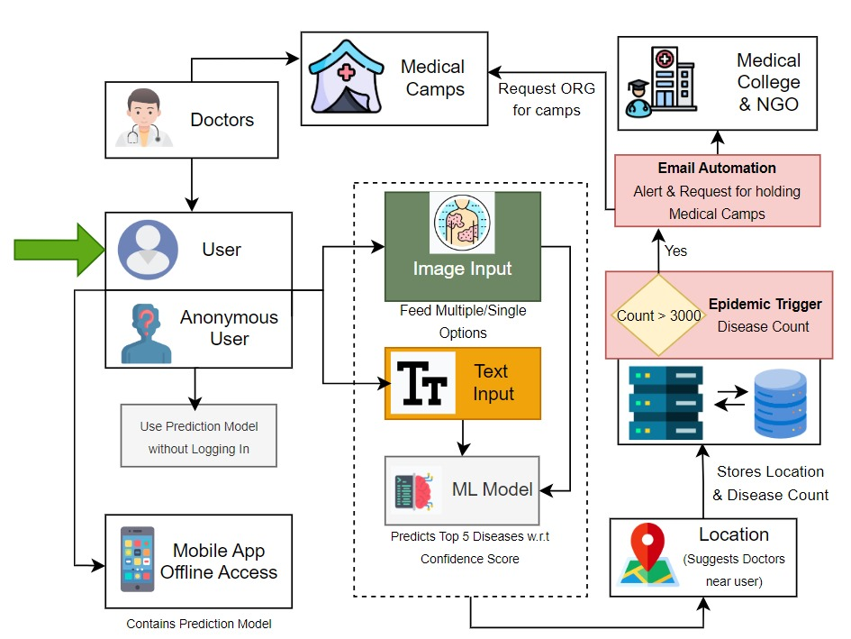

# SkinSage

SkinSage aims to develop a multifaceted system leveraging both web development and machine learning to address skin disease diagnosis and medical outreach efficiently. The system integrates the following features:

## Features

- Skin disease prediction from image. 
- Skin disease prediction from text description.
- Email Automation to medical hospitals & camps for a widespread disease at a particular location.
- Medical camp updates on the app. 

## Demo Video

https://www.youtube.com/watch?v=QWWow0O0Ek0

## User Flow Diagram

## Tech Stack

**Frontend**: React.js.

**Backend**: Node.js and Express.

**Database**: MongoDB.

**Machine Learning**: TensorFlow/Keras for image recognition and NLP models.

**Email Automation**: NodeMailer.
